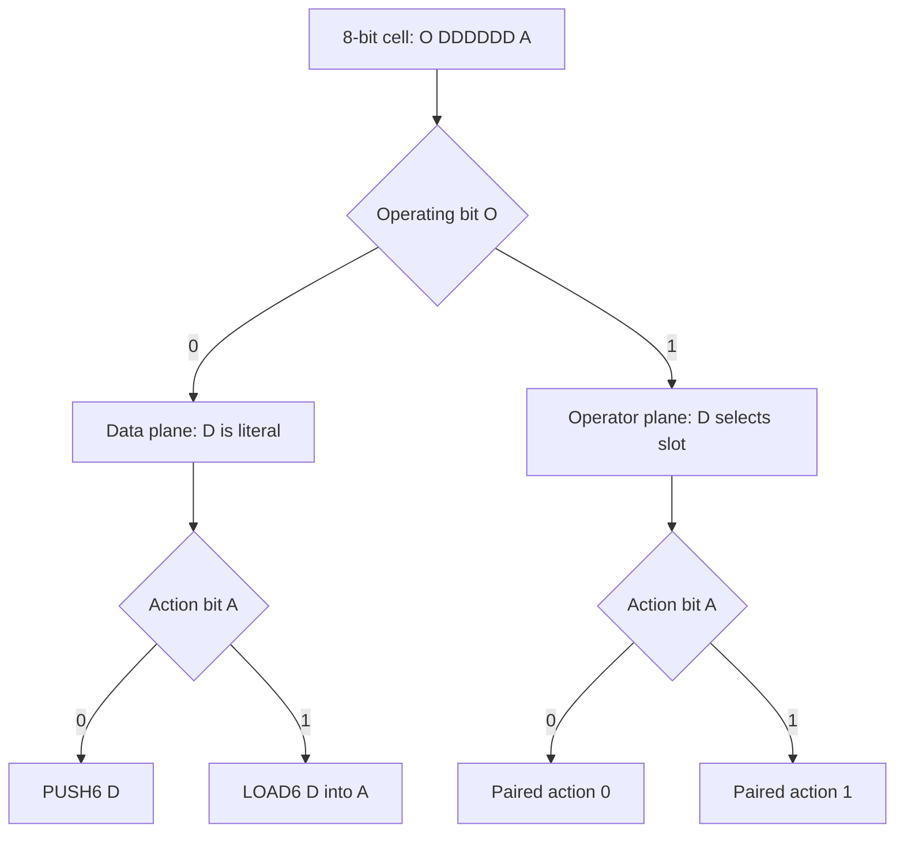
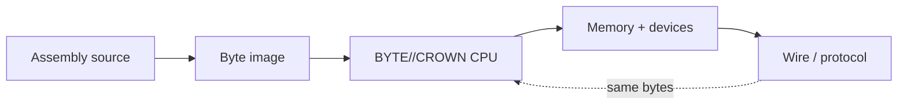

<picture>
  <source media="(prefers-color-scheme: dark)" srcset="./assets/byte-crown-header-dark.svg">
  <source media="(prefers-color-scheme: light)" srcset="./assets/byte-crown-header-light.svg">
  
</picture>

<h1 align="center">BYTE//CROWN</h1>

<p align="center">
  <strong>A complete byte-native computer, assembler, debugger, device bus, executable protocol laboratory, and AI-controllable machine in one HTML file.</strong>
</p>

<p align="center">
  <a href="./byte_super_machine.html"></a>
  <a href="#the-byte-law"></a>
  <a href="#ai-and-playwright-control"></a>
  <a href="https://cash.app/$unixarcade"></a>
</p>

<p align="center">
  
  
  
  
  
  
  
</p>

> **One byte can enter as data, become an instruction, alter memory, light a pixel, cross a port, travel as a protocol word, and return as state—without leaving the same semantic universe.**

That is BYTE//CROWN.

It is not merely an eight-bit CPU. It is a computer built around **byte-semantic continuity**: the machine word, instruction cell, assembly target, memory value, pixel, port value, and protocol atom all obey the same law.

<p align="center">
  <a href="#run-it">Run it</a> ·
  <a href="#the-byte-law">Learn the law</a> ·
  <a href="#machine-specification">Inspect the machine</a> ·
  <a href="#assembler">Write assembly</a> ·
  <a href="#ai-and-playwright-control">Control it with AI</a> ·
  <a href="#quantization-crown">Quantize reality</a> ·
  <a href="#release-proof">Read the proof</a>
</p>

---

## Run it

> [!IMPORTANT]
> BYTE//CROWN has no installer, package manager, server dependency, or build step. Download `byte_super_machine.html` and open it in a modern browser. For the most consistent local-file, audio, clipboard, and automation behavior, serve the folder over localhost.

```bash
python3 -m http.server 8080
```

Then open:

```text
http://127.0.0.1:8080/byte_super_machine.html
```

Inside the machine:

1. Choose one of the six demonstration programs.
2. Press **Load demo**.
3. Press **Assemble**.
4. Press **Run**.
5. Inspect the registers, flags, memory, disassembly, stack, terminal, framebuffer, trace, and living byte lens while the program executes.

### Your first BYTE//CROWN program

```asm
; 250 + 10 wraps through one byte to 4 and raises carry.
.org $0200
.entry start

start:
  PRINT "BYTE LAW ONLINE\n"
  LDI A, 250
  LDI B, 10
  ADD A, B
  OUT $03, A
  PRINT "<- wrapped byte with carry\n"
  HLT
```

Program-emitted terminal signal (after the machine's device-bus banner):

```text
BYTE LAW ONLINE
$04 <- wrapped byte with carry
```

---

## The byte law

Every executable cell preserves the original eight-bit grammar:

$$
\operatorname{byte} = (O \ll 7)\;|\;(D \ll 1)\;|\;A
$$

where $O \in \{0,1\}$, $D \in [0,63]$, and $A \in \{0,1\}$.

| `O` | `DDDDDD` | `A` | Meaning |
| :---: | :---: | :---: | --- |
| `0` | literal `0…63` | `0` | `PUSH6 D` — push the six-bit payload onto the byte stack |
| `0` | literal `0…63` | `1` | `LOAD6 D` — load the six-bit payload into register `A` |
| `1` | operator slot `0…63` | `0` | Execute the slot's first paired action |
| `1` | operator slot `0…63` | `1` | Execute the slot's second paired action |



### The conservation law

Traditional systems repeatedly translate between source code, object code, runtime values, wire schemas, display formats, and debugging representations. BYTE//CROWN deliberately collapses those boundaries.



The same byte can be:

| Role | Byte-native meaning |
| --- | --- |
| Instruction | An `O DDDDDD A` executable cell |
| Literal | A direct six-bit data action or full eight-bit operand |
| Memory | One addressable cell in the 64 KiB image |
| Stack state | One pushed value; wider state is multiple cooperating bytes |
| Register state | One of sixteen eight-bit general registers |
| Pixel | One `RRRGGGBB` framebuffer color |
| Port value | One byte crossing the memory-mapped device bus |
| Protocol atom | A byte that can be transported, stored, inspected, or executed unchanged |
| Debug evidence | The exact state shown by the lens, trace, memory view, or disassembler |

> [!NOTE]
> “Byte-sized computer” describes the architectural atom, not the total file size. The complete v2.1 browser embodiment is 98,586 bytes; every machine value that enters the architecture is still a byte. Wider addresses, clocks, and accumulated state emerge only from cooperating bytes.

---

## What BYTE//CROWN is

BYTE//CROWN is simultaneously:

- a complete stored-program byte computer;
- a two-pass assembler with labels, expressions, directives, and pseudo-forms;
- a 64 KiB memory machine with byte-pair addressing;
- a register, flag, stack, call, return, and interrupt architecture;
- a modern integer, bitwise, branch, string, vector, and device ISA;
- a debugger with breakpoints, disassembly, trace, and live mutation;
- a 16 × 16 byte-color framebuffer;
- a terminal, keyboard queue, audio device, clock, random source, and port bus;
- a snapshot and binary-image laboratory;
- a quantized arithmetic workbench;
- an executable protocol experiment;
- and an AI-controllable Playwright target.

The current release is **software-defined hardware** implemented in the browser. It is fully executable as a virtual machine while keeping its primitive architectural boundary explicitly eight-bit[^byte-law], and it is deliberately shaped so the ISA can later be ported into an FPGA core, microcontroller runtime, UEFI application, or physical educational computer.

---

## Machine specification

| Field | BYTE//CROWN v2.1 |
| --- | --- |
| Native atom | **8-bit byte** |
| Cell grammar | **`O DDDDDD A`** |
| Direct data-plane meanings | **128** — 64 payloads × 2 actions |
| Base operator actions | **128** — 64 paired slots × 2 actions |
| Extension actions | **64** |
| Searchable operator entries | **192** |
| Unified memory | **65,536 bytes / 64 KiB** |
| General registers | **16 × 8-bit** (`R0`–`R15`) |
| Named aliases | `A B C D E F X Y SI DI BP T0 CX TMP` |
| Flags | `C Z N V P I D T` packed into one byte |
| Program counter | Two cooperating bytes: `PCH:PCL` |
| Stack pointer | Two cooperating bytes: `SPH:SPL` |
| Memory address register | Two cooperating bytes: `MARH:MARL` |
| Instruction/data latches | Byte `IR` and byte `MDR` |
| Clock | Four cooperating bytes |
| Stack reset | `$FFDF` |
| Default code origin | `$0200` |
| Interrupts | 16 vectors plus `INT`, `RTI`, `CLI`, and `STI` |
| Framebuffer | 256 bytes at `$F000`, rendered as 16 × 16 `RRRGGGBB` pixels |
| MMIO | 16 byte ports at `$F100`–`$F10F` |
| Source form | One self-contained HTML file |
| Runtime dependencies | **0** |
| Build dependencies | **0** |
| Embedded executable proofs | **15 / 15 passing** |
| Release size | **98,586 bytes / 96.28 KiB** |
| SHA-256 | `ecba19486b6d4f111cb4545d93cf77625a9b487ceb785498725aa3e57188c1bb` |

### Width emerges; it never sneaks in

| Wider concept | Byte construction |
| --- | --- |
| 16-bit address | high byte + low byte |
| 16-bit stack position | `SPH` + `SPL` |
| 32-bit clock | four independently carried clock bytes |
| Memory vector | starting byte pair + byte count |
| Return state | individual flag, high-PC, and low-PC bytes on the stack |
| Snapshot | serialized collections of byte state |

This is the machine's central discipline: **nothing wider enters as a primitive**.

---

## Memory map

| Address range | Purpose |
| ---: | --- |
| `$0000–$EFFF` | General unified byte memory |
| `$F000–$F0FF` | 256-byte framebuffer |
| `$F100–$F10F` | Sixteen memory-mapped device ports |
| `$F110–$FFDF` | General high memory |
| `$FFE0–$FFFF` | Sixteen two-byte interrupt vectors |

Memory is code, data, pixels, vectors, stack, device state, and protocol material. The debugger does not invent a second representation: it shows the bytes themselves.

---

## Assembler

The assembler is built into the machine and emits the exact byte image the CPU executes.

### Accepted values

```text
42          decimal
$FF         hexadecimal
0xFF        hexadecimal
0b11111111  binary
'A'         character literal
```

### Directives

| Directive | Purpose |
| --- | --- |
| `.org address` | Move the assembly origin |
| `.entry label` | Select the reset entry point |
| `.equ name,value` | Define a constant expression |
| `.byte` / `.db` | Emit byte values or strings |
| `.word` / `.dw` | Emit a high-byte/low-byte pair |
| `.text` / `.ascii` | Emit text bytes |
| `.asciz` | Emit text followed by zero |
| `.fill count,value` | Emit a repeated byte |
| `.align n` | Advance to an aligned address |
| `.vector n,label` | Install one of sixteen interrupt vectors |

### Friendly forms

The source language accepts useful pseudo-forms and lowers them into real byte instructions:

```asm
MOV A, #42
MOV A, [source]
MOV [destination], A
ADDI A, 7
CLR B
TST C
PRINT "HELLO BYTE\n"
JE equal
HALT
```

`R15` / `TMP` is the documented scratch register used by immediate ALU pseudo-forms.

### Operator families

| Family | Representative operations |
| --- | --- |
| Data movement | `MOV XCHG LDI LEA LD ST LDX STX PUSH POP PUSHA POPA` |
| Arithmetic | `ADD ADC SUB SBB MUL IMUL DIV IDIV MOD IMOD INC DEC NEG ABS` |
| Quantized / bounded | `SATADD SATSUB QADD QSUB AVG ABSDIFF CLAMP MULHI` |
| Logic and bits | `AND NAND OR NOR XOR XNOR NOT TEST BT BTS BTR BTC` |
| Shifts and rotates | `SHL SHR SAR ASL ROL ROR RCL RCR BITREV NSWAP` |
| Comparison | `CMP CMPI SETcc MIN MAX SIGN SELECT CMOVG CMOVL CAS XADD` |
| Control flow | `JMP CALL RET RTI LOOP DJNZ` plus signed and unsigned branches |
| Interrupt and status | `INT SYSCALL CLI STI CLC STC CLD STD PUSHF POPF` |
| Strings and memory | `MOVS CMPS LODS STOS SCAS FILL MEMCPY MEMSET MEMCMP SEARCH` |
| Devices | `IN OUT RAND TIME SLEEP TONE PIXEL CLS` |
| Vectors | `VADD VSUB VMUL VDIV VAND VOR VXOR VMIN VMAX VCOPY VSORT` |
| Transform / hash | `GRAY UNGRAY LFSR CRC8 FNV8 MORTON DEMORTON NOISE8` |
| Debug and machine | `ASSERT TRACE BREAKPOINT RESET GETPC SETPC GETSP SETSP` |

<details>
<summary><strong>Open the complete 128-action base plane</strong></summary>

```text
NOP HLT BRK WAIT MOV XCHG LDI LEA LD ST LDX STX PUSH POP PUSHI DROP
PUSHA POPA ADD ADC SUB SBB MUL IMUL DIV IDIV MOD IMOD INC DEC NEG ABS
MIN MAX AND NAND OR NOR XOR XNOR NOT TEST SHL SHR SAR ASL ROL ROR
RCL RCR CMP CMPI SETZ SETNZ SETC SETNC SETS SETNS SETO SETNO SETP SETNP BT BTS
BTR BTC POPCNT CLZ CTZ BITREV NSWAP PACK JMP CALL RET RTI JZ JNZ JC JNC
JS JNS JO JNO JP JNP JA JAE JB JBE JG JGE JL JLE LOOP DJNZ
INT SYSCALL CLI STI CLC STC CLD STD MOVS CMPS LODS STOS SCAS FILL MEMCPY MEMSET
IN OUT RAND TIME SLEEP TONE PIXEL CLS VADD VSUB VMUL VDIV VAND VOR VXOR EXT
```

</details>

<details>
<summary><strong>Open the complete 64-action extension crown</strong></summary>

```text
PUSHF POPF GETSP SETSP GETPC SETPC SATADD SATSUB
QADD QSUB AVG ABSDIFF GCD POW SQRT LOG2
MULHI DIVREM CLAMP SIGN SELECT CMOVG CMOVL CAS
XADD SWAPM FENCE GRAY UNGRAY LFSR CRC8 FNV8
BCDADD BCDSUB DAA MORTON DEMORTON SINE8 COSINE8 NOISE8
VMIN VMAX VNEG VABS VCMP VFILL VCOPY VCRC
ASSERT TRACE BREAKPOINT RESET SEED PUSHPC POPPC ENTER
LEAVE MEMCMP SEARCH VREVERSE VSORT VROL VROR MAGIC
```

</details>

---

## Living debugger

The debugger is not an afterthought around the CPU. It is another view of the byte law.

| Surface | What it reveals |
| --- | --- |
| CPU bus | `PC`, `SP`, `IR`, `MAR`, `MDR`, four-byte clock, and state |
| Registers | Sixteen live bytes with names, hex, and decimal values |
| Flags | All eight packed status bits |
| Memory | A directly editable 256-byte page |
| Disassembly | Instruction boundaries, operands, descriptions, and breakpoints |
| ISA browser | Searchable base and extension actions |
| Living Byte Lens | Bits `O D5 D4 D3 D2 D1 D0 A`, numeric forms, meaning, and mutation |
| Stack | The next sixteen bytes above `SP` |
| Trace | Recent instruction address, opcode, operands, accumulator, and flags |
| Terminal | Host text plus byte device stream |
| Framebuffer | Every byte in `$F000–$F0FF` rendered as one pixel |

### Manual controls

| Input | Action |
| --- | --- |
| **Assemble** | Two-pass assembly into unified memory |
| **Run** | Execute at the selected frame quota |
| **Pause** | Suspend execution without destroying state |
| **Step** / <kbd>F8</kbd> | Execute one instruction |
| <kbd>F9</kbd> | Toggle run and pause |
| <kbd>Ctrl</kbd>/<kbd>⌘</kbd> + <kbd>Enter</kbd> | Assemble from the editor |
| **Reset** | Reset CPU state while preserving the assembled image |
| **Living Byte Lens** | Toggle bits, perform integer-like operations, write, or execute a byte |

---

## Devices

BYTE//CROWN includes a real device surface behind the ISA:

- byte terminal output;
- UTF-8 host input encoded into an eight-bit keyboard queue;
- sixteen memory-mapped ports;
- deterministic random source and seed control;
- four-byte machine time;
- sleep and wait states;
- square-wave tone generation;
- 16 × 16 byte-pixel framebuffer;
- trace output;
- local source and snapshot storage;
- ASM, JSON snapshot, and 64 KiB binary import/export.

The framebuffer color law is `RRRGGGBB`: three red bits, three green bits, and two blue bits. Every pixel is one byte because the display obeys the same architectural atom as the CPU.

---

## Six executable demonstrations

| Demo | Proof |
| --- | --- |
| **Crown demo** | Terminal, framebuffer, wrapped carry, and `GCD` |
| **Fibonacci** | Register movement, arithmetic, looping, and byte overflow |
| **Interrupt vector** | Vector installation, `INT`, stack state, and `RTI` |
| **Vector forge** | True byte-memory arrays and vector operations |
| **Pixel bloom** | Nested byte loops driving the framebuffer |
| **Pure data plane** | `PUSH6` and `LOAD6` executing the original one-byte law directly |

---

## AI and Playwright control

BYTE//CROWN exposes a deliberate automation contract. An AI agent does not need to guess coordinates or scrape decorative text.

The machine itself needs no packages. To drive it from Node.js, add the optional browser harness:

```bash
npm add --save-dev playwright
npx playwright install chromium
```

### Readiness contract

```js
await page.waitForSelector('html[data-byte-crown-ready="true"]');
```

The root element continuously mirrors:

| Attribute | Meaning |
| --- | --- |
| `data-byte-crown-ready` | Automation API is installed |
| `data-byte-crown-state` | `ready`, `running`, `waiting`, `sleeping`, `breakpoint`, `halted`, or `fault` |
| `data-byte-crown-pc` | Current program counter in hex |
| `data-byte-crown-sp` | Current stack pointer in hex |

Every major control also has a stable `data-testid="byte-crown-*"` selector.

### Control surface

```js
window.ByteCrownAI
```

| Domain | Methods |
| --- | --- |
| Source and assembly | `getSource`, `setSource`, `assemble`, `loadDemo`, `runProgram` |
| Execution | `start`, `runToStop`, `waitForStop`, `pause`, `step`, `reset`, `executeByte` |
| CPU state | `getState`, `getRegister`, `setRegister`, `getFlags`, `setFlags`, `setPC`, `setSP` |
| Memory | `readMemory`, `writeMemory`, `getFramebuffer`, `selectMemory` |
| Debugging | `setBreakpoint`, `toggleBreakpoint`, `clearBreakpoints`, `setWatchpoint`, `disassemble` |
| Devices | `sendInput`, `getTerminal`, `clearTerminal` |
| Machine image | `getSnapshot`, `loadSnapshot` |
| Interface | `selectRegister`, `openPane`, `selectors` |
| Proof and sharing | `selfTest`, `share` |

<details open>
<summary><strong>Playwright: assemble, execute, and inspect a program</strong></summary>

```js
import { chromium } from 'playwright';

const browser = await chromium.launch();
const page = await browser.newPage();

await page.goto('http://127.0.0.1:8080/byte_super_machine.html');
await page.waitForSelector('html[data-byte-crown-ready="true"]');

const result = await page.evaluate(() => ByteCrownAI.runProgram(`
  .org $0200
  .entry start
start:
  LDI A, 250
  LDI B, 10
  ADD A, B
  ST [$1000], A
  HLT
`, 1000));

console.log(result.execution.reason);             // halted
console.log(result.execution.state.registers[0]); // 4
console.log(result.execution.state.flagBits.C);   // true

const stored = await page.evaluate(() =>
  ByteCrownAI.readMemory('$1000', 1)
);

console.log(stored); // [4]
await browser.close();
```

</details>

<details>
<summary><strong>Playwright: operate through visible controls</strong></summary>

```js
await page.getByTestId('byte-crown-demo').selectOption('data');
await page.getByTestId('byte-crown-loadDemo').click();
await page.getByTestId('byte-crown-run').click();

await page.waitForFunction(() =>
  document.documentElement.dataset.byteCrownState === 'halted'
);

const terminal = await page
  .getByTestId('byte-crown-terminal')
  .textContent();
```

</details>

<details>
<summary><strong>Playwright: breakpoint, keyboard byte, and snapshot</strong></summary>

```js
const receipt = await page.evaluate(() => {
  ByteCrownAI.loadDemo('fibonacci', true);
  ByteCrownAI.setBreakpoint('$0200', true);

  const stopped = ByteCrownAI.runToStop(1000);
  ByteCrownAI.clearBreakpoints();

  const image = ByteCrownAI.getSnapshot();
  ByteCrownAI.sendInput('Q');
  ByteCrownAI.loadSnapshot(image);

  return {
    stopped,
    pc: ByteCrownAI.getState().pc,
    listing: ByteCrownAI.disassemble('$0200', 8)
  };
});
```

</details>

The API is a second control plane, not a second source of truth. It calls the same assembler, CPU, devices, memory, debugger, and rendering state as the human interface.

---

## Quantization crown

BYTE//CROWN is naturally suited to quantized computation because bytes are not merely a storage optimization; they are the machine's numerical law.

### Already executable

| Capability | Existing operators |
| --- | --- |
| Unsigned saturation | `SATADD`, `SATSUB` |
| Signed quantized saturation | `QADD`, `QSUB` |
| Bounded values | `CLAMP`, `MIN`, `MAX` |
| Reduced products | `MULHI` |
| Averaging and distance | `AVG`, `ABSDIFF` |
| Vector arithmetic | `VADD`, `VSUB`, `VMUL`, `VDIV` |
| Vector logic | `VAND`, `VOR`, `VXOR` |
| Vector transforms | `VMIN`, `VMAX`, `VNEG`, `VABS`, `VCMP`, `VFILL` |
| Table-friendly nonlinear math | `SINE8`, `COSINE8`, `LOG2`, `SQRT` |
| Compact integrity signals | `CRC8`, `FNV8`, `VCRC` |

### Natural next instructions

These are roadmap targets, not claims about the current v2.1 build:

- `QMAC` — quantized multiply-accumulate into four cooperating accumulator bytes;
- `DOT8` — byte-vector dot product;
- `REQUANT` — fixed-point scale, shift, zero-point, round, and clamp;
- `PACK4` / `UNPACK4` — two four-bit values per byte;
- `LUT` — byte-indexed activation and transfer functions;
- `QRND` — selectable deterministic rounding laws;
- `QCONV` — compact quantized convolution kernel;
- shared-exponent block floating point.

The deeper opportunity is not only quantizing values. BYTE//CROWN can quantize **behavior**: the same byte can carry a compact value, select an operation, and specify its action.

---

## Where this architecture has leverage

General-purpose computers can perform these jobs faster at scale. BYTE//CROWN's advantage is different: **small state, explicit semantics, deterministic execution, transportability, and total byte-level observability**.

1. Quantized edge inference and tiny classifiers.
2. Sensor normalization, thresholding, and anomaly detection.
3. Executable serial, mesh, MIDI, and device protocols.
4. Packets that carry both state and bounded behavior.
5. Deterministic robot reflex and actuator controllers.
6. Swarm rule capsules and store-and-forward computation.
7. Programmable packet filtering and protocol bridging.
8. Exhaustive opcode, fault-injection, and replay experiments.
9. Assembly, CPU, compiler, and protocol education.
10. Byte-native pixel art, cellular automata, and demoscene work.
11. Tiny executable configuration and event journals.
12. Artificial-life and evolutionary bytecode research.

The most radical application is a network whose messages are machines: a transported byte stream can enter memory unchanged, execute under a budget, transform local state, and travel onward.

---

## Release proof

BYTE//CROWN contains its own executable proof suite. The v2.1 release passes all fifteen machine invariants.

<details open>
<summary><strong>15 / 15 embedded machine proofs</strong></summary>

- [x] 64 paired operator slots
- [x] 128 unique base mnemonics
- [x] 64 functional extension names
- [x] `O DDDDDD A` opcode closure
- [x] data-plane `PUSH6` and `LOAD6`
- [x] ALU wrap, carry, zero, and parity
- [x] labels and conditional looping
- [x] `CALL` / `RET` stack fidelity
- [x] absolute and indirect memory
- [x] signed branch flags
- [x] extension `GCD` and saturation
- [x] vector sort and addition
- [x] interrupt vector and `RTI`
- [x] byte-addressed framebuffer
- [x] expression-parser precedence

</details>

### Browser acceptance receipt

| Test | Result |
| --- | ---: |
| JavaScript syntax | **PASS** |
| Embedded machine proofs | **15 / 15 PASS** |
| Demonstration programs | **6 / 6 assemble and halt cleanly** |
| Playwright automation schema | **`BYTE-CROWN-PLAYWRIGHT/1` ready** |
| Stable automation selectors | **343 / 343 unique in the default render** |
| Synchronous API execution | **PASS** |
| Animated frame execution | **PASS** |
| Breakpoint stop and resume | **PASS** |
| `WAIT` + injected keyboard byte `Q` | **81 / `$51` received** |
| Snapshot round trip | **PASS** |
| Native share path | **PASS** |
| Clipboard share fallback | **PASS** |
| Cash App destination | **`https://cash.app/$unixarcade` verified** |
| Runtime console errors | **0** |
| Desktop horizontal overflow at 1600 px | **0** |
| Mobile horizontal overflow at 390 px | **0** |

The proof surface matters because this project is deliberately strange. Its behavior should be inspectable enough that “wild” never has to mean “hand-wavy.”

---

## Share, export, and preserve

The machine includes:

- **Share BYTE//CROWN** — native Web Share with clipboard fallback;
- **Support `$unixarcade`** — direct Cash App route;
- local source save;
- assembly listing copy;
- source export as ASM;
- complete 64 KiB image export as binary;
- full machine snapshot export as JSON;
- import of ASM, text, binary images, and snapshots.

Snapshot state includes source, all 65,536 memory bytes, registers, PC, SP, flags, IR, four-byte clock, deterministic RNG state, terminal, and ports.

---

## Publish with GitHub Pages

Use either deployment shape:

### Keep the machine name

Place these files in the repository:

| Path | Purpose |
| --- | --- |
| `README.md` | Repository front panel |
| `byte_super_machine.html` | Complete machine |
| `assets/byte-crown-header-dark.svg` | Dark-mode README crown |
| `assets/byte-crown-header-light.svg` | Light-mode README crown |

Enable Pages from the repository root, then visit:

```text
https://<account>.github.io/<repository>/byte_super_machine.html
```

### Make BYTE//CROWN the root experience

Copy or rename `byte_super_machine.html` to `index.html`, enable Pages from the repository root, and visit:

```text
https://<account>.github.io/<repository>/
```

No asset pipeline or build job is required by the machine itself.

---

## Design laws for contributors

1. **Preserve `O DDDDDD A`.** Extensions must deepen the law, not evade it.
2. **Keep the byte primitive.** Wider state must remain an explicit cooperation of bytes.
3. **Keep code executable.** Every documented operation should assemble, run, and be testable.
4. **Keep state visible.** New machinery should expose its effects to the debugger or automation API.
5. **Keep the human and AI interfaces coherent.** Do not create two conflicting control systems.
6. **Keep the artifact portable.** The one-file machine remains a first-class release.
7. **Add proof with power.** New instructions and devices should arrive with executable invariants.
8. **Degrade cost, not meaning.** Mobile and constrained machines must retain the byte law and complete controls.

Before proposing an ISA change, answer four questions:

- What byte meaning is being added?
- Why can the existing operators not express it cleanly?
- Which flags, registers, memory cells, or ports can it change?
- What executable proof demonstrates closure?

---

## Roadmap

- [ ] Quantization crown: `QMAC`, `DOT8`, `REQUANT`, packed INT4, LUT activations
- [ ] Standalone formal ISA and protocol specification
- [ ] Conformance vectors for independent implementations
- [ ] Self-hosted BYTE//CROWN assembler
- [ ] FPGA soft-core reference implementation
- [ ] UEFI / bare-metal machine port
- [ ] Microcontroller device-bus implementation
- [ ] Executable packet budget and capability model
- [ ] Four-byte accumulator and block-floating arithmetic
- [ ] Reproducible release workflow and signed machine images

---

## Forge lineage

BYTE//CROWN began with Luminosity's byte-machine idea: the first bit operates, the middle six bits carry data, and the final bit tells the array what to do. The full computer grew by combining that law with the larger forge constellation.

| Forge | Contribution to the crown |
| --- | --- |
| Original Byte Machine | `O DDDDDD A` and integer-like byte operation |
| ARRAY2 Browser CPU | Executable CPU structure and browser-resident machine thinking |
| AETHLESS Software Forge | Compiler semantics, object law, and transformation discipline |
| Nibble & Byte Forge | Compact representation and byte-scale composition |
| Unified Hyperforge | Integration across machine surfaces |
| Storage Superforge | Snapshots, images, import/export, and preservation |
| Sovereign Mind Forge | Explicit state continuity and inspectability |
| Nightdeck | Cyberdeck tactility and terminal language |
| Federation Forge | Protocol and multi-node implications |
| Energon Forge | Bounded intensity, signal, and motion |
| Matrix Runner | Counterfactual execution, proof, and hostile-state thinking |
| Beautiful Book | Proportion, symbolic clarity, and visual discipline |

Concept, direction, and the original byte law: **Luminosity / Matthew Kowalski / UnixArcade**.

Architecture, implementation, debugging, testing, and documentation were forged with **Gpteus**, the electric-sprite code collaborator.

---

## Keep the byte alive

BYTE//CROWN is built in the spirit of small sovereign computing: understandable machinery, explicit state, direct operation, no surveillance substrate, and no mandatory service between the operator and the metal-shaped idea.

If the project gives you a new way to think about computers, protocols, quantization, or executable art, support the work that keeps these strange machines coming.

<div align="center">

[](https://cash.app/$unixarcade)

### [Support `$unixarcade` on Cash App](https://cash.app/$unixarcade)

[UnixArcade on GitHub](https://github.com/unixarcade) ·
[Luminosity on Gumroad](https://luminosity.gumroad.com/) ·
[Luminosity on LiveJournal](https://luminosity.livejournal.com/)

</div>

Every contribution buys time for the invisible work: the instruction that becomes coherent only after the ninth rewrite, the mobile control that refuses to cover one byte, the proof that catches a beautiful mistake, and the experiment strange enough to open a new branch of the machine.

---

<div align="center">

### **BYTE//CROWN // O DDDDDD A // MACHINE ONLINE**

`NOTHING WIDER ENTERS · WIDTH EMERGES FROM COOPERATING BYTES`

**One byte. Two planes. Sixty-four slots. An unreasonable amount of computer.**

</div>

[^byte-law]: BYTE//CROWN uses “byte-native” to describe its primitive machine law. The browser hosting the virtual machine naturally runs on wider contemporary hardware; the architectural boundary remains explicitly eight-bit.
